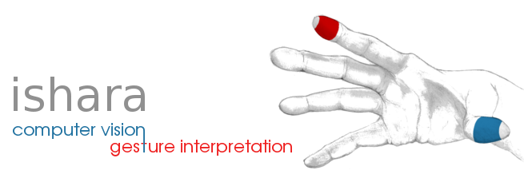

Ishara - Mouse Control with Gesture
===============================================

--------------------------
Ishara is a perceptive user interface based on computer vision.
Ishara is a gesture interpretation system and is used to emulate
the computer mouse with finger gestures. The objective behind
this project was to develop an intuitive and fun way to interact
with computers and other digital devices.
Ishara started as a hobby project and became open source in 2013.

Ishara consists of a built-in or USB webcam and a software developed
through this project. The camera is placed on top of the display screen
facing the user and the user uses two different color-markers on the
fingers to control the mouse pointer. The user can do all shorts of
actions that is actually done using a mouse including left-click,
right-click, scroll and drag-n-drop.

It is developed using OpenCV and Qt and written in C++.
The initial prototype runs on Linux and there is no Mac or Windows version yet.

Requirements :white_check_mark:
-------------------------------
:pushpin: OpenCV

:pushpin: Qt Development Libraries

:pushpin: V4l2 Development Libraries

:pushpin: XTEST Extension Libraries

:pushpin: CMake

:pushpin: Make

Compilation :arrow_forward:
---------------------------
Once you have setup the dependencies, download the source:
```
$ cd ~/Downloads
$ git clone https://github.com/saikatbsk/Ishara.git
```

Create and move into the build directory:
```
$ mkdir -p Ishara/build
$ cd Ishara/build
```

Run *cmake* followed by *make* to build Ishara:
```
$ cmake ..
$ make
```

To install:
```
$ sudo make install
```

Links :link:
------------
* [Ishara on Youtube](https://www.youtube.com/watch?v=B1_xtdR8pn4)
* [OpenCV](http://opencv.org/)

> Live long and may the source be with you. :octocat:
